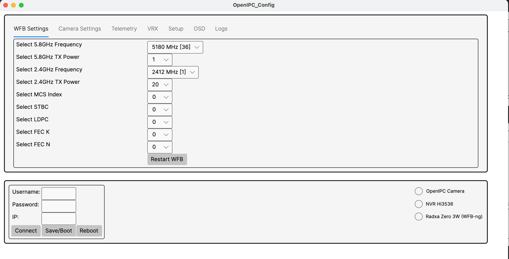
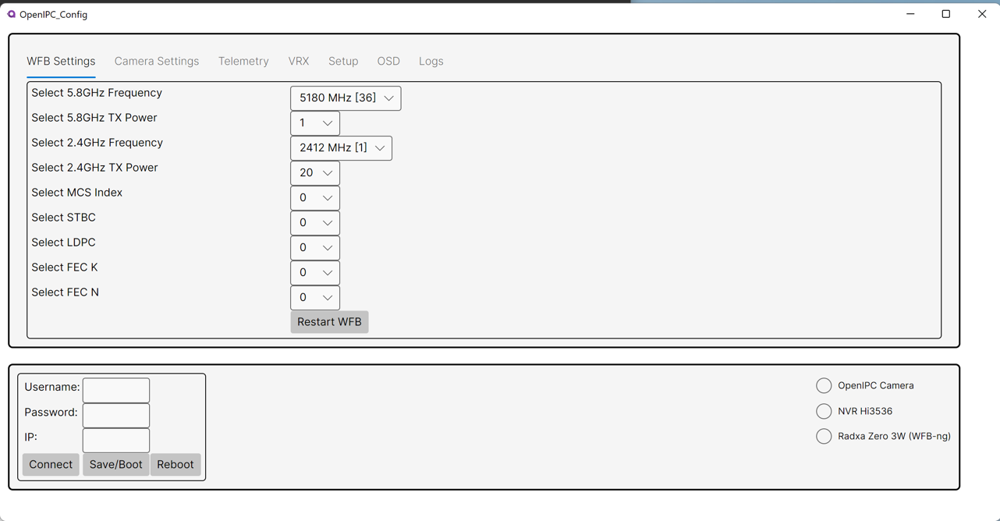

# OpenIPC Config

A multiplatform application


Mac



Windows



## MVVM Organization
* ViewModels: Contains the logic that interacts with the UI (View). ViewModels should be focused on data-binding and commands.
* Models: Represents the application's data and business logic.
* Services: Holds application-wide services and utilities, such as logging, SSH clients, and network access. Helper classes like Logger and SSHClient would typically go here.
* Infrastructure: Optionally, you can have an infrastructure folder for low-level technical details such as communication with external systems (e.g., SSH).
* Views: Contains the Avalonia XAML files and code-behind (if needed).

## Publishing


```console
dotnet publish -c Release -r <RID> --self-contained
```

### Publishing
* Mac

    ```bash
    dotnet publish -c Release -r osx-arm64 --self-contained
    ```
* Windows
    ```bash
    dotnet publish -c Release -r win-x64 --self-contained
    ```

* Linux x64
    ```bash
    dotnet publish -c Release -r linux-x64 --self-contained
  
    ```

* For ARM-based Linux distributions (e.g., Raspberry Pi, Radxa?), use:
    ```bash
    dotnet publish -c Release -r linux-arm --self-contained
    ```

* One command:
  ```bash
    dotnet publish -c Release -r osx-arm64 --self-contained -o ./publish/osx-arm64
    dotnet publish -c Release -r linux-x64 --self-contained -o ./publish/linux-x64
    dotnet publish -c Release -r win-x64 --self-contained -o ./publish/win-x64
  ```


### Supported Runtimes

1. Windows
   * x86 (32-bit)
     * win-x86
   * x64 (64-bit)
     * win-x64
   * ARM (32-bit)
     * win-arm
   * ARM64 (64-bit)
     * win-arm64
2. Linux
   * x64 (64-bit)
     * linux-x64
   * x86 (32-bit)
     * linux-x86
   * ARM (32-bit)
     * linux-arm
   * ARM64 (64-bit)
     * linux-arm64
   * MIPS64 (64-bit)
     * linux-mips64
   * MIPS64el (Little Endian)
     * linux-mips64el
   * Alpine Linux (musl-based)
     * linux-musl-x64
     * linux-musl-arm
     * linux-musl-arm64
3. macOS
   * x64 (Intel-based)
     * osx-x64
   * ARM64 (Apple Silicon)
     * osx-arm64
4. FreeBSD
   * x64 (64-bit)
     * freebsd-x64
5. Android
   * ARM (32-bit)
     * android-arm
   * ARM64 (64-bit)
     * android-arm64
   * x86 (32-bit)
     * android-x86
   * x64 (64-bit)
     * android-x64
6. iOS
   * ARM64 (64-bit)
     * ios-arm64
   * Simulator (x64)
     * ios-simulator-x64
7. tvOS
   * ARM64 (64-bit)
     * tvos-arm64
   * Simulator (x64)
     * tvos-simulator-x64
8. watchOS
   * ARM64 (64-bit)
     * watchos-arm64
   * Simulator (x64)
     * watchos-simulator-x64
9. Tizen
   * x86
     * tizen-x86
   * ARM
     * tizen-armel


## Issues
* dotnet add package Avalonia.Android
  * error: NU1202: Package Avalonia.Android 11.1.4 is not compatible with net8.0 (.NETCoreApp,Version=v8.0). Package Avalonia.Android 11.1.4 supports: net8.0-android34.0 (.NETCoreApp,Version=v8.0)
    error: Package 'Avalonia.Android' is incompatible with 'all' frameworks in project '/Users/mcarr/RiderProjects/OpenIPC-Config/OpenIPC-Config.csproj'.

## References
